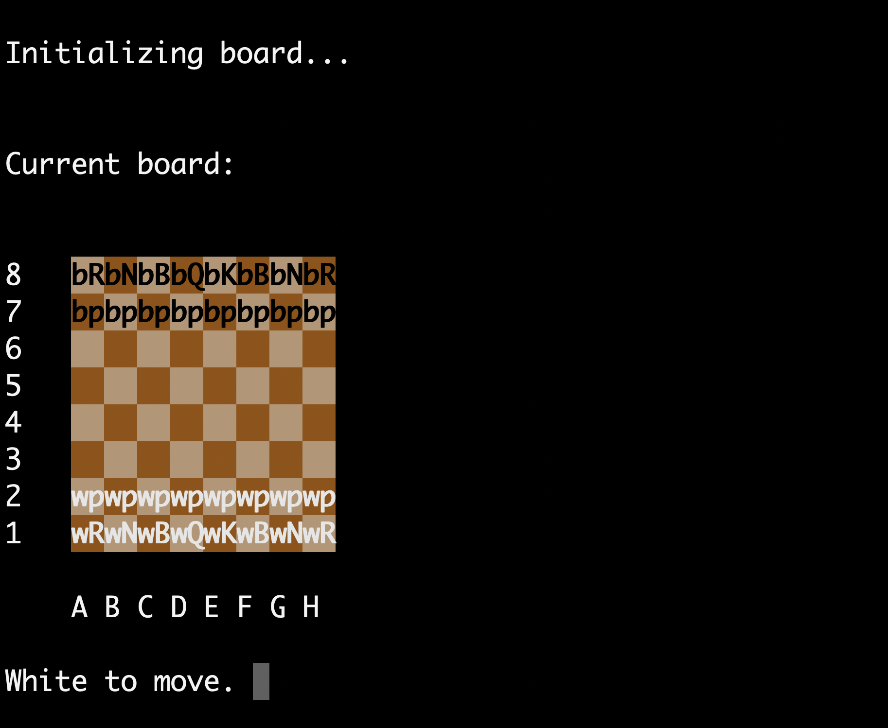

# C++ Chess Interface

#### As an avid chess player and a computer science major in college, it has always been my goal to build something chess-related. This, along with my ambition to graduate from C to C++, has lead me to work on this passion project in my spare time.

#### This is a simple command line chess interface I've created. Running the make command creates a chess board made of text on the command line. File and rank names are printed at the left side and bottom, the board is set properly for a chess game, and white is prompted to move. Distinct color/piece combinations are represented using two letters: the first expressing the color, and the second expressing the piece. That is, a white pawn is represented on the board as "wp", while a black king is represented as "bK". While this is technically enough information to play a chess game, this alone would make everything hard to see. Hence, I've colored the board and pieces by applying ANSI codes to text colors and backgrounds.

### Note:
#### This project is deliberately raw, and the code is probably not optimal in terms of logical structure. There are also a few files that are completely useless, contrary to my original intent. This is because I made it a point not to look up too tutorials or read other peoples' implementations. I wanted to see what it would be like to represent the rules of chess from the ground up. One day, I hope to perhaps work in developing chess-related software professionally; until then, this is my starting project!

## Instructions for running and interacting:
#### To make the executable, enter the "make" command in the command line. This will create an executable file named chess, which can be run by entering ./chess.

#### Moves must be entered in something called "algebraic notation", the standard notation used to record chess games. The rules for this notation are briefly described below:
- **Pieces are represented by the following letters:**
  - Kings: K
  - Queens: Q
  - Rooks: R
  - Bishops: B
  - Knights: N
- **When a piece moves to a square, the move is recorded as the letter of the piece followed by the square. Here are some examples:**
  - Knight moves to the f3 square: Nf3
  - Queen moves to e5: Qe5
- **Pawns don't technically count as "pieces" in chess, so pawn moves are recorded with just the square the pawn is moving to (ex: e4 means a pawn moves to the e4 square)**
- **When a piece captures something on a square, this is represented by the piece letter, followed by the letter x, then the square (ex: Bxf7 means the bishop captures something on the f7 square)**
- **When a pawn captures something, in place of its piece name (because it has none), a the letter of the file it was on is entered; the rest is the same as above (ex: if the pawn on e4 takes the pawn on d5, this is recorded as exd5)**
- **Castling kingside is represented as 0-0, and queenside castling is represented as 0-0-0. Note: while it is common to use the digit 0, the letter O is sometimes used too**
- **Check is represented by adding a "+" to a move (ex: Queen moves to h5 with check is recorded as Qh5+)**
- **Checkmate is represented by adding a "#" to a move (ex: Queen takes on f2 delivering checkmate is recorded as Qxf2#)**
- **Finally, when a pawn reaches the end of the board and promotes, this is represented by writing the move, an equals sign, and the letter of the piece the pawn promotes to (ex: if the pawn on a7 reaches a8 and becomes a knight, this is recorded as a8=N)**

#### At the moment, only pawn moves are possible. However, every pawn move (besides check and checkmating moves) have been accounted for including en passant and promotion.
